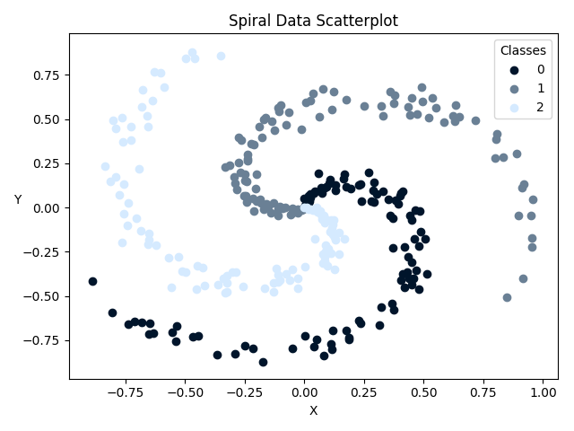
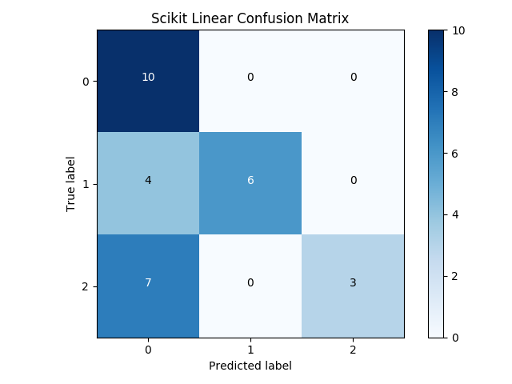
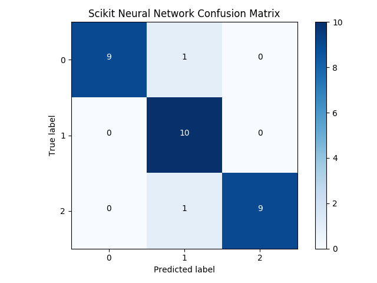
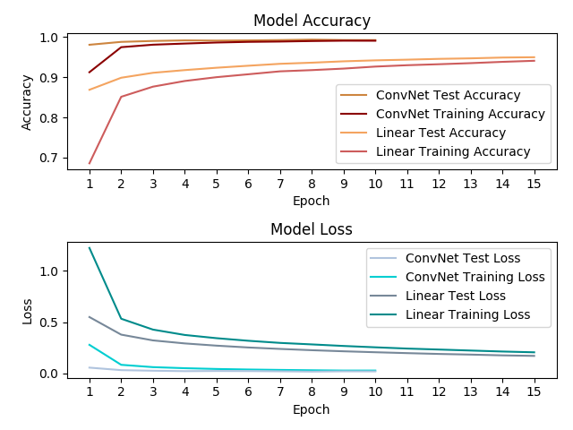

# Machine Learning

Classifying a spiral data set using a Linear and a Neural Network classifier using the Sciki-learn framework.
Using matplotlib to plot the data and the result as a confustíon matrix.

Classifying the MNIST hand written digits data set using Keras, using both a Linear and a Convolutional Neural Network classifier.
Using matplotlib to plot the results over epochs trained.

## Scikit

## Keras

### Linear/ConvNet MNIST Classifer
#### Linear (15 epochs)
**Test Accuracy** 0.9506  
**Test Loss** 0.1692  
**Linear Time** 86.6515 s  

#### ConvNet (10 epochs)
**Test Accuracy** 0.9942  
**Test Loss** 0.0197  
**ConvNet Time** 375.9757 s 

